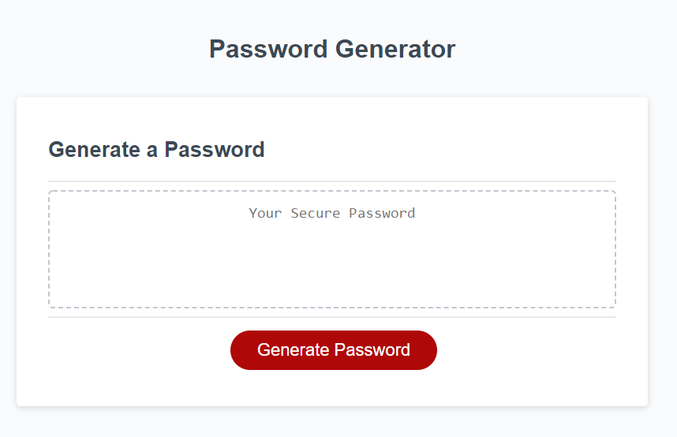
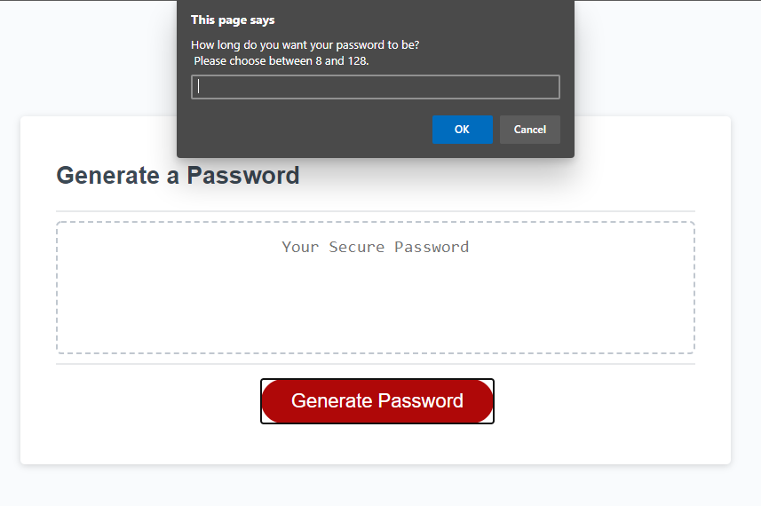
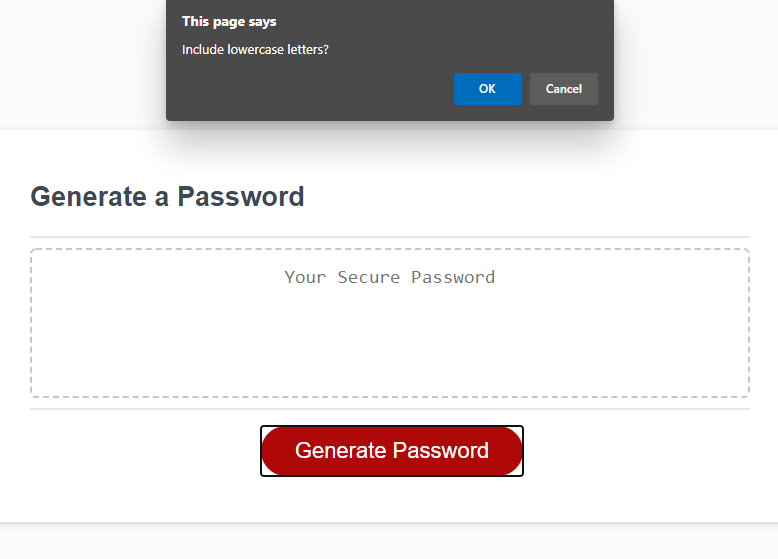
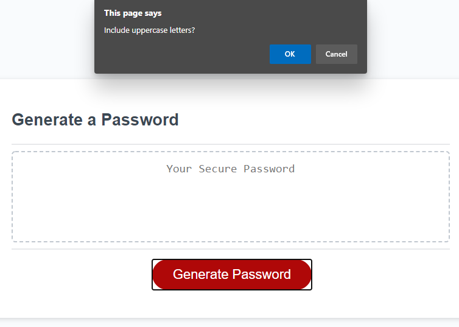
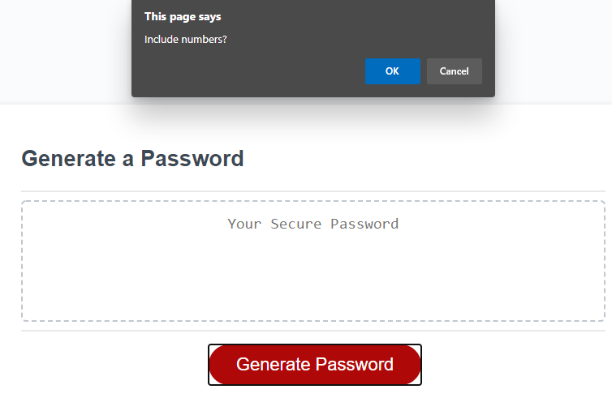
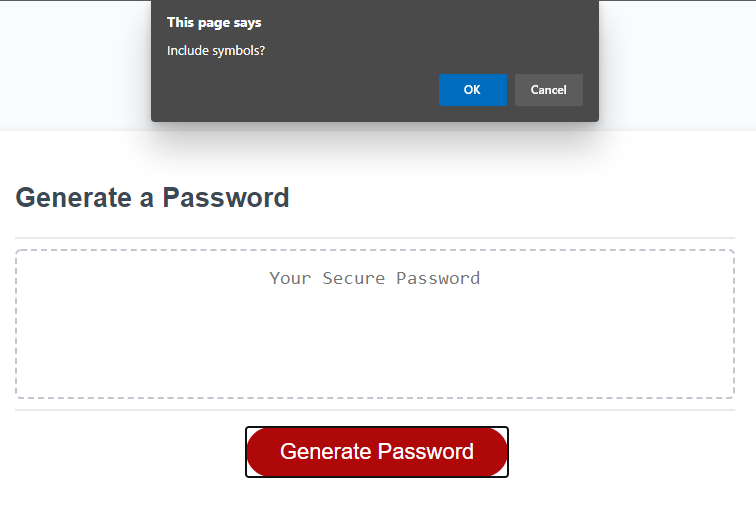
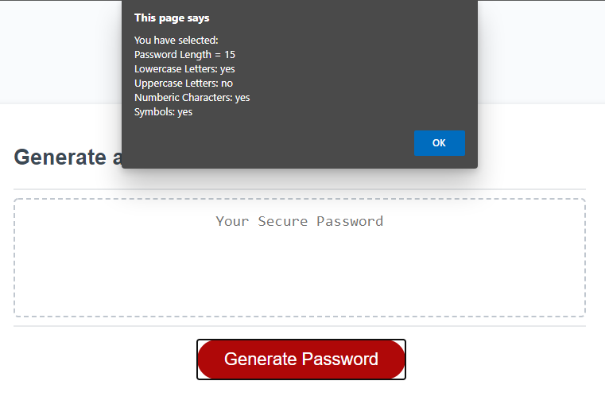
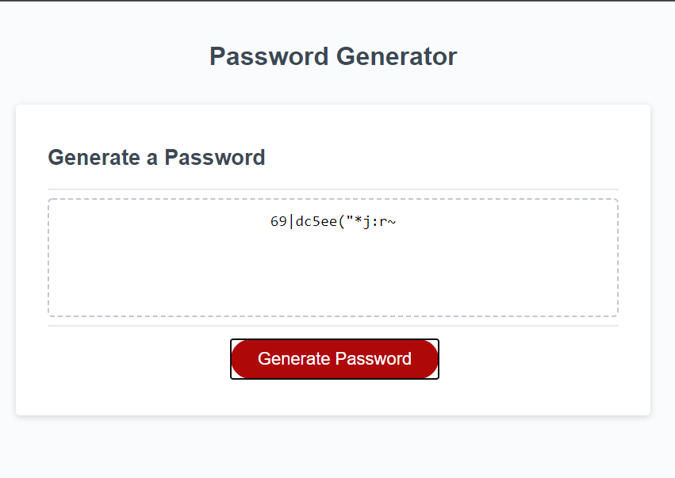

# PandaPassGen

    ## You can access the website through the link below:
        https://codingpanda224.github.io/PandaPassGen/

# The website will generate a password following the criteria that the user inputs.

The main site will look like this. Clicking on the red button will begin the process.

You are then prompted with selecting the length of the password.
 

After that, the page will ask whether to include Lowercase letters, Uppercase letters, Numeric Characters and symbols in order. 
 
 
 
 

Finally the prompt should show you a summary.
 

Resulting then, in a password that matches all selected criteria.

 

